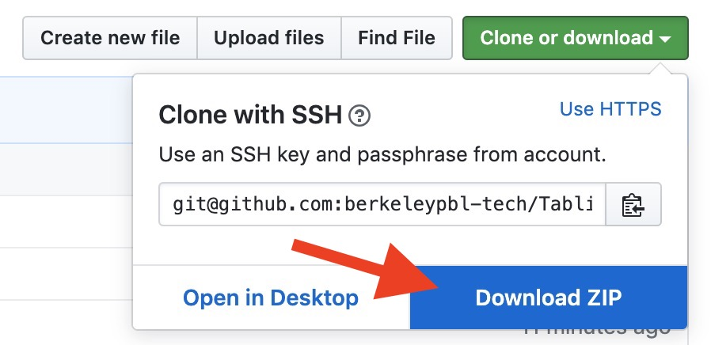

# PBL Tabling Portal
This repository contains the necessary files and instructions needed to manage the PBL online portal at https://berkeleypbl-tech.github.io. Outlines steps needed in order to update weekly tabling assignments.

## Scheduler
This section outlines the necessary files needed in order to properly schedules tabling slots for members based on their preferences.

1. Navigate to the following private repository https://github.com/berkeleypbl-tech/TablingScheduler.
2. Download all the files from the github repository to your machine.
  
3. Navigate to the folder containing the files in your terminal.
4. Follow the directions in the README.
  > Make sure to run the python commands with python3.

## Website Portal
This section outlines necessary steps to follow in order to update the PBL online portal (https://berkeleypbl-tech.github.io).

1. Clone the repository onto your local machine.
2. Edit the following files on your local machine:
  - `swap.html`
  - `input.html`
  - `main.js`

### Editing Files
#### Swap and Input Forms
For `swap.html` and `input.html` create two new Google Forms (one for initial input from all members, second for general swapping of slots).

##### Replacing Links
Once the files have been created, replace the link on **line 43** in both files with their respective Google Form links. In `main.js` replace the link on **line 29** with the input form and replace the link on **line 37** with the swap form.

#### Modifying Form Structure
If you decide to create new Google Forms mimicking the current style but with slight modifications, you will have to edit the `csv_to_json.py` file in the **TablingScheduler** folder downloaded earlier. For example if I changed the format for the times from **10:00~11:00** to **10:00 - 11:00** in the form and also capitalized the questions titled "Officer" and "Schedule" from their lower-case versions in the input form, I would need to modify that file.

In this situation you would need to modify the code on lines **58, 60, 62, 64, 71, 72** in accordance with the format that you created the form with.

#### Tabling Days
If you only wish to table from Monday - Thursday (no tabling on Friday) you will have to edit the `tabling_annealer.py` file in the **TablingScheduler** folder downloaded earlier. One can also modify the number of people per slot on **line 10** and the number of days on **line 66**. If you wish to table on Friday there are also changes that needed to be made on the front-end files pertaining to the actual website itself.

### Pushing Changes Live
Run the following commands:
```
git add --all
git commit -m "message describing changes"
git push -u origin master
```

## Questions
Any questions should be directed to the current VP of Technology who should redirect any questions to previous owners/users of this service.
